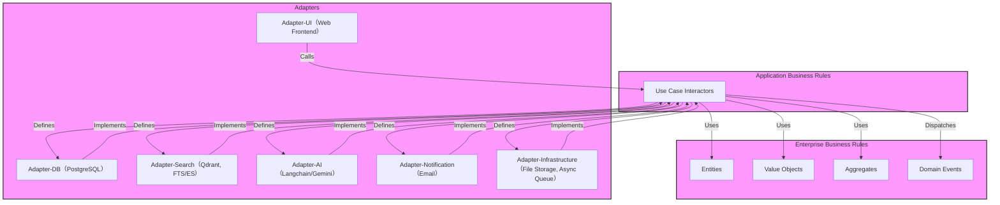

# DeepRead クリーンアーキテクチャ設計定義 (v1.0)

**関連Issue:** ISSUE-020 (TASK-ARCH-01)
**作成日:** 2025-05-04

## 1. 目的

本ドキュメントは、DeepReadプロジェクトにおけるソフトウェアアーキテクチャとしてクリーンアーキテクチャを採用し、そのレイヤー構造、主要コンポーネント、および依存関係ルールを定義することを目的とします。これにより、関心事の分離、テスト容易性、保守性、拡張性の向上を目指します。

## 2. レイヤー構造と責務定義

DeepReadは以下のレイヤーで構成されます。

* **Domain (ドメイン層 / Enterprise Business Rules):**
    * **責務:** アプリケーションに依存しない、中核となるビジネスロジックとルールを表現します。システムの核となる概念（エンティティ、値オブジェクト、集約）と、それらの状態変化（ドメインイベント）を定義します。
    * **コンポーネント例:** `UserAccount`, `Document`, `Library`, `UserInteraction` 集約、`Page`, `ContentElement`, `QApair`, `UserSettings` エンティティ/値オブジェクト、`DocumentUploaded` ドメインイベントなど。
    * **依存:** 他のどのレイヤーにも依存しません。
* **UseCase (ユースケース層 / Application Business Rules):**
    * **責務:** アプリケーション固有のビジネスルールを実装します。特定のユースケース（例: ユーザ登録、PDFアップロード、質問応答）を実現するための処理フローを定義・実行（Interactor）。ドメイン層のオブジェクトを操作し、永続化や外部サービス連携のためのインターフェース（Repository, Gateway）を定義します。
    * **コンポーネント例:** `RegisterUser`, `UploadDocument`, `AskQuestion`, `GetLibraryDocuments` Interactor、`UserRepository`, `DocumentRepository`, `AIGateway` インターフェースなど。
    * **依存:** Domain層にのみ依存します。
* **Adapters (アダプター層):**
    * **責務:** UseCase層で定義されたインターフェースを実装し、外部の技術詳細（UI、DB、AI、検索エンジン、通知、インフラ）と内部のビジネスロジックを接続します。データの変換や外部API呼び出しなどを担当します。
    * **サブレイヤー:**
        * **Adapter-UI:** Webフロントエンド（フレームワークは別途選定）、APIエンドポイント（Django View/Controllerなど）。UseCase Interactorを呼び出します。
        * **Adapter-DB:** PostgreSQLとのデータ永続化を担当。UseCase層で定義されたRepositoryインターフェースを実装します（例: `PostgresUserRepository`）。
        * **Adapter-Search:** ベクトルDB（Qdrant）や全文検索エンジン（PostgreSQL FTS or Elasticsearch）との連携を担当。UseCase層で定義されたSearch Gatewayインターフェースを実装します。
        * **Adapter-AI:** 生成AI API（Gemini等）や埋め込みAPIとの連携を担当（Langchain経由）。UseCase層で定義されたAI Gatewayインターフェースを実装します。
        * **Adapter-Notification:** メール送信など、外部通知サービスとの連携を担当。UseCase層で定義されたNotification Gatewayインターフェースを実装します。
        * **Adapter-Infrastructure:** ファイルストレージ（S3等）や非同期タスクキュー（Celery等）との連携を担当。UseCase層で定義されたGateway/Interfaceを実装します。
    * **依存:** UseCase層に依存します（インターフェースを通じて）。
* **Infrastructure (インフラストラクチャ層):**
    * **責務:** フレームワーク（Django）、DB（PostgreSQL）、外部ライブラリ、OS、ネットワークなど、アプリケーションを動作させるための基盤技術の詳細を含みます。Adapters層はこのインフラを利用してインターフェースを実装します。
    * **依存:** アプリケーションのコアロジック（Domain, UseCase）はこのレイヤーに依存しません。

## 3. 主要ドメインモデルと集約（初期案）

`requiremets.yml` のドメインモデル案に基づき、以下の集約を定義します（詳細は開発中に洗練）。

* **`UserAccount` 集約:**
    * **ルートエンティティ:** `User` (ID, Email, HashedPassword)
    * **関連:** `TermsAgreement` (VO), `UserSettings` (VO or Entity)
    * **責務:** ユーザ認証情報、プロファイル、利用規約同意状況、ユーザ固有設定の管理。
* **`Library` 集約:**
    * **ルートエンティティ:** `Library` (ID, UserID)
    * **関連:** `Document` (Entity) のリストへの参照（ID）
    * **責務:** 特定ユーザに紐づくドキュメントコレクション全体の管理、ドキュメント追加・削除の起点。
* **`Document` 集約:**
    * **ルートエンティティ:** `Document` (ID, Title, OriginalFileName, Status, UploadedAt, LibraryID)
    * **関連:** `Page` (Entity), `ContentElement` (VO), `EmbeddingVector` (VO), `DocumentMetadata` (VO), `Tag` (VO or Entity)
    * **責務:** 単一ドキュメントの内容（ページ、抽出要素、ベクトル、メタデータ）、解析状態、タグの管理。
* **`UserInteraction` 集約:**
    * **ルートエンティティ:** `UserInteractionLog` (ID, UserID, Timestamp, Type)
    * **関連:** `QASession` (Entity), `QApair` (VO), `SummarizationRequest` (VO), `FeedbackRecord` (VO)
    * **責務:** ユーザ操作履歴、Q&Aセッション、質問応答ペア、要約要求、フィードバック情報の記録・管理。

**(図示はテキストベースでは困難なため、リスト形式で表現)**

## 4. 主要ユースケースとInteractor（リストアップ）

`requiremets.yml` および `agile_practice.yml` に基づく主要なユースケースと、それに対応するUseCase層のInteractor（クラス名例）です。

* **認証・同意:**
    * `RegisterUser` (US-AUTH-001)
    * `LoginUser` (US-AUTH-002)
    * `RequestPasswordReset` (US-AUTH-003)
    * `ResetPassword` (US-AUTH-003)
    * `AgreeToTerms` (US-LEGAL-001)
* **PDFパイプライン:**
    * `UploadDocument` (US-UPLOAD-001)
    * `ProcessDocumentPage` (TASK-PIPE-01 内) - (非同期タスクとして実行される内部UseCase)
    * `HandleDocumentProcessingCompletion` (TASK-PIPE-01 内)
* **ライブラリ管理:**
    * `GetLibraryDocuments` (US-LIB-001)
    * `SearchLibraryDocuments` (US-LIB-002)
    * `AddTagToDocument` (US-LIB-003)
    * `RemoveTagFromDocument` (US-LIB-003)
* **Q&A・要約・抽出:**
    * `AskSingleDocumentQuestion` (US-QA-001)
    * `AskCrossDocumentQuestion` (US-QA-002)
    * `ExtractText` (US-EXTRACT-001)
    * `SummarizeText` (US-SUMM-001)
* **フィードバック・改善:**
    * `RecordFeedback` (US-FEEDBACK-001)
    * `ImproveQAData` (US-IMPROVE-001) - (バッチ処理UseCase)
* **設定:**
    * `GetUserAISettings` (US-SETTINGS-001派生)
    * `UpdateUserAISettings` (US-SETTINGS-001)
    * `GetDocumentProcessSettings` (US-SETTINGS-002派生)
    * `UpdateDocumentProcessSettings` (US-SETTINGS-002)

## 5. レイヤー間のインターフェース定義方針

* **依存性の逆転:** UseCase層は具体的な外部技術（DB、AI等）を知るべきではありません。UseCase層でインターフェース（抽象）を定義し、Adapters層でそれを実装します（Dependency Inversion Principle）。
* **Repositoryパターン:** ドメインオブジェクトの永続化（DBアクセス）のために使用します。
    * `UserRepository`, `DocumentRepository`, `LibraryRepository`, `UserInteractionRepository`, `UserSettingsRepository` などのインターフェースを **UseCase層** で定義します。
    * これらのインターフェースの具象クラス（例: `PostgresUserRepository`）を **Adapter-DB層** で実装します。
    * UseCase Interactorはインターフェースに依存し、DI（Dependency Injection）コンテナ等を通じて具象クラスのインスタンスを受け取ります。
* **Gatewayパターン:** 外部サービス（AI、検索、通知、ファイルストレージ、非同期キュー等）へのアクセスを抽象化するために使用します。
    * `AIGateway`, `SearchGateway`, `NotificationGateway`, `FileStorageGateway`, `AsyncTaskQueueGateway` などのインターフェースを **UseCase層** で定義します。
    * これらのインターフェースの具象クラスを **Adapters層** の各サブレイヤー（Adapter-AI, Adapter-Search, Adapter-Notification, Adapter-Infrastructure）で実装します。
    * UseCase Interactorはインターフェースに依存し、具象クラスのインスタンスを受け取ります。**特に、ライセンス上の制約となりうる外部コンポーネント（例: PDF画像化におけるPoppler）や、将来変更される可能性のある技術については、このパターンを用いて依存性をAdapter層に隔離し、交換を容易にすることが重要です。**
* **Data Transfer Objects (DTOs):** レイヤー間でデータを渡す際に、ドメインオブジェクトを直接渡さず、シンプルなDTOを使用することを検討します（特にUIとの境界）。

## 6. 依存関係の方向性ルール

* **厳格な内向き依存:** 依存関係は常に外側のレイヤーから内側のレイヤーへ向かいます (Adapters -> UseCases -> Domain)。
* **Domain層の独立性:** Domain層は他のどのレイヤー（UseCase, Adapters, Infrastructure）にも依存しません。
* **UseCase層の独立性:** UseCase層はDomain層にのみ依存します。Adapters層やInfrastructure層には依存しません。
* **Adapters層の役割:** Adapters層はUseCase層（インターフェース）とInfrastructure層（具体的技術）の両方に依存し、両者をつなぐ役割を果たします。
* **フレームワーク依存の隔離:** Djangoなどのフレームワークや外部ライブラリへの依存は、可能な限りAdapters層およびInfrastructure層に閉じ込め、Domain層とUseCase層を保護します。

## 7. 設計ドキュメント

* **形式:** 本Markdownドキュメントが設計定義の一次資料となります。
* **図:** 必要に応じて、Mermaidなどのツールを用いた図を本ドキュメントに埋め込むか、別ファイルとして参照します（上記レイヤー図参照）。
* **更新:** プロジェクトの進行に合わせて、本ドキュメントは継続的にレビュー・更新されます。
